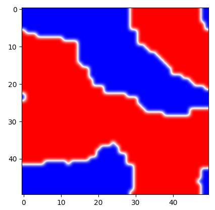
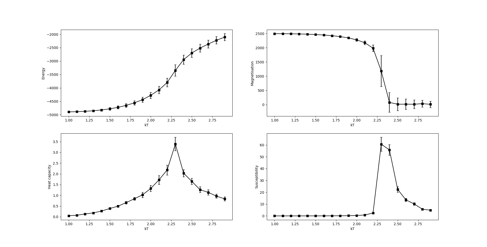

# Ising model

### Simulation of the Ising model of ferromagnetism using Glauber and Kawasaki dynamics.

To display a visualisation, run `python ising_model.py vis <grid size~50> <temperature~1> <method~G|K>`, G for Glauber dynamics and K for Kawasaki. The simulation begins from randomised up or down spins and converges to a steady state.

Near the beginning, the simulation can look like this:

while later on it may reach a fully blue/red screen (Glauber) or a vertical/horizontal stripe (Kawasaki).

The system was studied over time and at various temperatures and yielded results such as

Indicating that with Glauber dynamics the average energy of the system increased with temperature while the average magnetisation dropped off at around 2.25 K. The heat capacity and the magnetic susceptibility both peaked at around this temperature indicating high variability and a phase change.